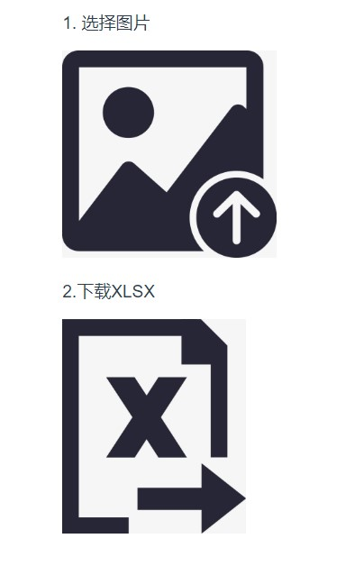

[TOC]

# 说明
图片(位图)是一个个像素点, 把每一个像素填到excel的单元格, 就能在excel里组成一个图片. 
就像这样: 


# 程序使用

打开dist/index.html: 


# 源码说明
## 使用的工具
- vue框架, vue-cli生成项目脚手架
- [sheetjs](https://github.com/SheetJS/sheetjs) js操作excel
- [protobi/js-xlsx](https://github.com/protobi/js-xlsx) sheetjs的fork, 可以设置单元格的样式

## 启动
```
cd picture2xlsx
npm install
npm run serve 
```
